# Introduction

Network analysis has gained popularity in recent years. By the development of R-packages like \emph{qgraph} [@epskamp2012] and \emph{igraph} [@csardi2006], it has become easier to visualize network structures and apply different estimation methods. The drawback of this is that users have to learn \texttt{R} in order to use these packages. The goal of this application was to design and programme a web application that enables users to visualize and analyze networks without having to know the R-language itself. This manual will aid users and explain all the functions and options that are currently available within the application. 

# Uploading Data

In the grey left panel of the application, users can upload either a &quot;.txt&quot; or a &quot;.csv&quot; file. Users only have to specify the type of data that they are uploading, how missing values, if present, are coded within the data file, and whether character variables (variables that contain words instead of numbers) should be coded as \emph{factors}. In the case that the user discriminated between different scores by using words, this option should be checked.


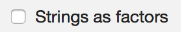

### Data Types

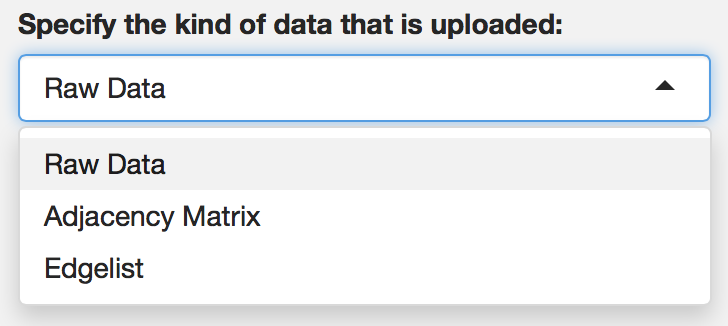

The user can enter three different types of data. The first option is &quot;raw data&quot;. When you have raw data, your datafile consists of columns, which indicate the individual items or variables, and rows that signify each individual participant or measurement of those items or variables. Below is a simplified example of what raw data looks like.

```{r, echo = FALSE}

data.frame(participant = 1:10, Item1 = round(sample(1:7, 10, TRUE),0), Item2 = round(sample(1:5, 10, TRUE), 0))
```

The next available option as a data type is the &quot;adjacency matrix&quot;. When you use an adjacency matrix, the data will have the individual items or variables on both the rows and the columns, and each cell indicate whether there is a relation between the two variables, and if so, how strong this relation is. To illustrate, let us take the following adjacency matrix:

```{r, echo = FALSE}
data.frame(Item1 = c(0, 1, 2, 1), Item2 = c(1, 0, 3, 2), Item3 = c(2, 3, 0, 1), Item4 = c(1, 2, 1, 0))
```

In this example, it can be seen that there are four variables, as there are four rows and columns. Between variable 1 and 2, a relation exists with strength 1. In this example, the diagonal consists of zeroes, which is not obligatory; it is possible to construct a network with so-called \emph{self-loops}: edges that start and finish at the same node without the interference of some other node. Furthermore, the example above depicts a symmetrical matrix, but this does not have to be the case: networks can be constructed in which the relation from A to B is different from the relation from B to A.

The last available data type is the &quot;edge list&quot;. An edge list is characterized by two columns that depict the starting and ending node for each individual edge, which are represented by the rows. Take for example the edge list below:

```{r, echo = FALSE}
data.frame(from = 1:5, to = c(2, 3, 4, 5, 1))
```

In this example, an edge originates in node 1, and ends in node 2, without the interference of some other node. 

In the examples that were previously used, a header existed that shows the variable name for each column. Note that this may help in the identification of nodes when a network is constructed, but that a header is not necessary in order to construct a network.

### Missing Data

After you have specified your data, you can specify the symbol used for missing data, if these exist in your data file. If you do not have any missing data, you can leave this box empty.

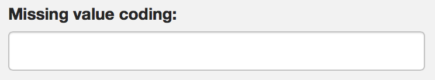

### Example Data

If you do not have any data (yet) that can be used to construct networks, you can download an example data set, which is a raw data file that contains the first 25 variables of the NEO-PI-R. This data is made available via the *psych* package.

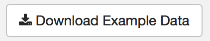

# Network Analysis

After entering all specifications with respect to the data, a network is automatically constructed and displayed on the right, in the tab *Network*:

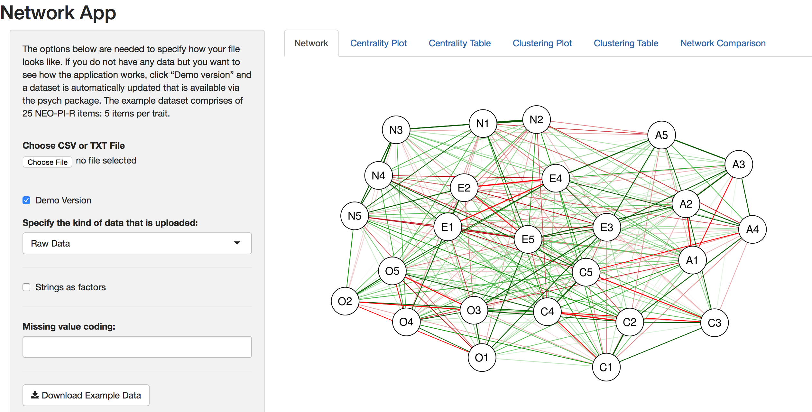

This network is constructed by means of the default values that exist. Almost everything can be changed with respect to the network esthethics, and the estimation of the network. I will explain all options in more detail below.

### Network Estimation

There are various methods for estimating a network structure. The NetworkApp has employed 7 methods that are used often. Note that the estimation methods only with when you use raw data. As the absence/presence of edges and/or their strength is already specified in an adjacency matrix or edge list, the estimation methods become redundant.

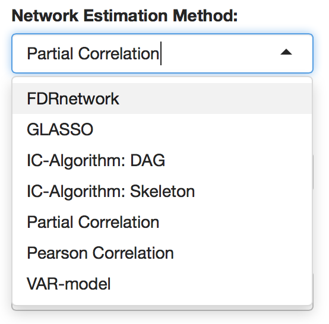

#### FDR Network

The *FDR Network* estimation method estimates a network based on the False Discovery Rate (FDR). By setting a cutoff value between 0 and 1, edges with an FDR higher than the cutoff value will be removed from the network.

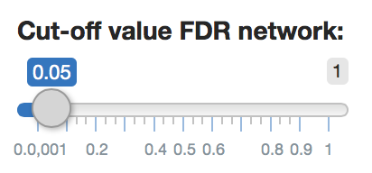

There are three different methods that can be used to create an FDR network:

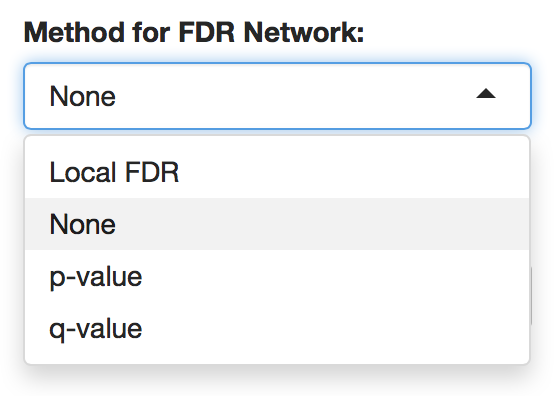

One can use a local false discovery rate, the *p*-value, or the *q*-value. When estimating an FDR network, one is obliged to specify the method and a cut-off value.

#### GLASSO

The *GLASSO* estimation method is used to control for spurious correlations that may arise due to multiple testing. To create a sparse network, the EBICglasso, which uses penalized maximum likelihood estimation, is applied to set spurious connections to zero. The result is a network in which connections between nodes represent a nonzero partial correlation, while controlling for all other nodes in the network [@kossakowski2015].

No further action is required of the user to construct a GLASSO network: by selecting GLASSO, the application will automatically construct this type of network.

#### IC-Algorithm: Skeleton


#### IC-Algorithm: DAG

The *IC-Algorithm: DAG* estimation method can be used to construct a *Directed Acyclic Graph* (DAG) by using the *Inferred Causation (IC) Algorithm* [@pearl2009]. This DAG is created by means of the *pcalg* package [@kalisch2012]. This function estimates the equivalence class of a DAG, which means that multiple networks can describe the same set of conditional independencies. More specifically, a *Completed Partially Directed Acyclic Graph* (CPDAG) is estimated, which is a network that may contain both directed and undirected edges. A directed edges is drawn when this edge is present in all DAGS in the equivalence class, and an undirected edge is drawn when at least one DAG contains the edge with direction a --> b, and at least one DAG that contains the same edge, but with direction b --> a.

When the user wants to estimate a DAG, one also has to specify which method is to be used to test the conditional independencies:

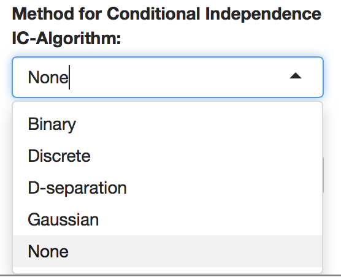

The choice of method mainly depends on the data: If the data contains Gaussian data, the user would choose Gaussian. The same holds for Binary data and Discrete (multinomial) data. D-separation is a special method that states that two variables are conditionally independent controlling for a third variable if that third variable blocks ALL paths between the initial two variables.


#### Partial Correlation

#### Pearson Correlation

#### VAR-model


### Small World Index

The *Small World Index* (SWI) is an index that tells you whether a network is in fact a small world or not. A Small World Network is a network in which the average distance between two nodes resembles that of a Random Network, and where the average ratio between the amount of existing edges and possible edges (*clustering*) is high in comparison to a Random Network [@watts1998]. 

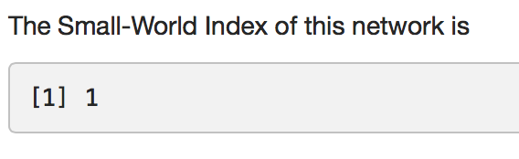

A network is considered a Small World Network when the SWI is higher or equal to 3. The SWI is automatically calculated for each network that is constructed, and will be re-calculated when parameters are changed.

### Download Network

Each network that is constructed can be download as a .pdf file by clicking on the corresponding button:

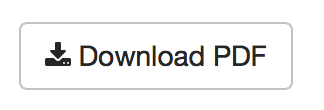


# Network Esthethics

# Centrality Analyses

# Clustering Analyses

# Network Comparison


# References